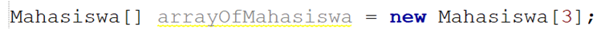
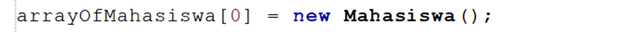
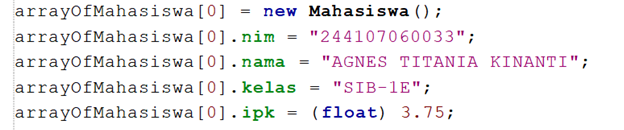
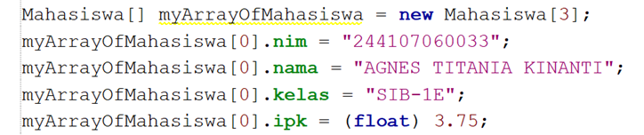

# Jobsheet 3 PASD
## 3.2.3 Questions
### 1. Based on test 3.2, does a class that will create an array of objects always have to have both attributes and methods ? Explain!
No, because a class can exist with only attributes (as a way to store data) and/or only methods.
### 2. What does the following program code do?

Declares an array named arrayOfMahasiswa that can hold 3 references to Mahasiswa objects.
### 3.	Does the Student class have a constructor? If not, why is the constructor called in the following line of the program?

No, the student class doesn’t have a constructor. The constructor is called because java automatically provides a default constructor.
### 4.	What does the following program code do?

Instantiation (creates a new Mahasiswa object and assigns it to the first index of the array)
Initialization (assigns values (NIM, Name, Class, GPA) to the attributes of the object.)
### 5.	the Student and StudentDemo classes separated in test 3.2?
Yes, as both classes are public, they need to be in separate files.
## 3.3.3 Questions
### 1.	Add the printInfo() method to the Student class then modify the program code in step no. 3.
```java 
void printInfo() {
    System.out.println("NIM     : " + nim);
    System.out.println("Nama    : " + name);
    System.out.println("Kelas   : " + class_);
    System.out.println("IPK     : " + GPA);
    System.out.println("------------------------------------");}
    for (int i = 0; i < 3; i++) {
      System.out.println("Data Mahasiswa ke-" + (i + 1));
      arrayOfStudent[i].printInfo();
    }
```
### 2. Suppose you have a new array array of type Students named myArrayOfStudents . Why does the following code cause an error?

Because the object on the 0<sup>th</sup> index haven’t been instantiated yet.

## 3.4.3 Questions
### 1.	Can a class have more than 1 constructor? If yes, give an example.
yes, a default and a parameterized constructor

- Default:
  ```java
  public Course5() {}
  ```
- Parameterized:
  ```java
  public Course5(String code, String name, int credits, int totalHours) {
    this.code = code;
    this.name = name;
    this.credits = credits;
    this.totalHours = totalHours;
  }
  ```
### 2.	Add the addData() method to the Matakuliah class , then use this method in the MatakuliahDemo class to add Course data.
Course5.java
```java
void addData(Scanner sc) {
  System.out.print("Code         : ");
  this.code = sc.nextLine();
  System.out.print("Name         : ");
  this.name = sc.nextLine();
  System.out.print("Credits      : ");
  this.credits = Integer.parseInt(sc.nextLine());
  System.out.print("Total Hours  : ");
  this.totalHours = Integer.parseInt(sc.nextLine());
  System.out.println("------------------------------------");
}
```
CourseDemo5.java

```java
for (int i = 0; i < 3; i++) {
  arrayOfCourse[i] = new Course5();
  System.out.println("Enter Course Data #" + (i + 1));
  arrayOfCourse[i].addData(sc);
}
```
### 3.	Add the printInfo() method to the Matakuliah class , then use this method in the MatakuliahDemo class to display the input data on the screen.
Course5.java
```java
void printInfo() {
  System.out.println("Code         : " + code);
  System.out.println("Name         : " + name);
  System.out.println("Credits      : " + credits);
  System.out.println("Total Hours  : " + totalHours);
  System.out.println("------------------------------------");
}
```
  Course5Demo.java
```java
for (int i = 0; i < 3; i++) {
  System.out.println("Data Course #" + (i + 1));
  arrayOfCourse[i].printInfo();
}

```
### 4.	Modify the program code in the MatakuliahDemo class so that the length (number of elements) of the array of Matakuliah objects is determined by the user via input with Scanner
```java
Scanner sc = new Scanner(System.in);
System.out.print("Enter the number of courses you want to add: ");
Course5[] arrayOfCourse = new Course5[Integer.parseInt(sc.nextLine())];
System.out.println();
for (int i = 0; i < arrayOfCourse.length; i++) {
  arrayOfCourse[i] = new Course5();
  System.out.println("Enter Course Data #" + (i + 1));
  arrayOfCourse[i].addData(sc);
}
for (int i = 0; i < arrayOfCourse.length; i++) {
  System.out.println("Data Course #" + (i + 1));
  arrayOfCourse[i].printInfo();
}
```

## 3.5 Task
<pre>
1. Create a program to display information about lecturers. 
  The program can accept input of all lecturer-related information and display it back on the screen. This program consists of the Dosen<NoPresensi> class with the following attributes/properties: 
  - Code string
  - Name string
  - Boolean gender
  - int age 

  with the constructor method as follows;
    public lecturer( String code, String name, Boolean gender, int age ) {
    …………….;
    …………….;
    }

  create a class DosenDemo<NoPresensi> to process input and display data for several lecturers. Use a loop with FOR To create an array of objects , use FOREACH looping. to display data on the screen.

   2. Add a new class DataDosen<NoPresensi> with the following methods ;
   -	dataAllDosen(Dosen[] arrayOfDosen) to display data for all lecturers
   -	numberOfLecturersPerGender(Lecturers[] arrayOfLecturers) to display data on the number of lecturers per gender (Male / Female)
   -	AverageAgeOfLecturersPerGender ( Lecturers[] arrayOfLecturers ) to display the average age of lecturers per gender (Male / Female)
   -	infoDosenPalingTua ( Dosen[] arrayOfDosen ) to display the oldest lecturer data
   -	infoDosenMostYoungest ( Dosen[] arrayOfDosen ) to display the youngest lecturer data
</pre>

**Lecturer5.java**
```java
package Jobsheet3;

public class Lecturer5 {
  public String code;
  public String name;
  public boolean gender;
  public int age;

  public Lecturer5(String code, String name, boolean gender, int age) {
    this.code = code;
    this.name = name;
    this.gender = gender;
    this.age = age;
  }
}
```
**LecturerDemo5.java**
```java
package Jobsheet3;

import java.util.Scanner;

public class LecturerDemo5 {
  public static void main(String[] args) {
    Scanner sc = new Scanner(System.in);
    System.out.print("Enter number of lecturers: ");
    int count = Integer.parseInt(sc.nextLine());

    Lecturer5[] arrayOfLecturer = new Lecturer5[count];

    for (int i = 0; i < count; i++) {
      System.out.println("Enter Lecturer Data #" + (i + 1));
      System.out.print("Code           : ");
      String code = sc.nextLine();
      System.out.print("Name           : ");
      String name = sc.nextLine();
      System.out.print("Gender (M/F)   : ");
      String genderInput = sc.nextLine();
      boolean gender = genderInput.equalsIgnoreCase("M");
      System.out.print("Age            : ");
      int age = Integer.parseInt(sc.nextLine());
      System.out.println("------------------------------------");

      arrayOfLecturer[i] = new Lecturer5(code, name, gender, age);
    }

    System.out.println("\nDISPLAYING LECTURER DATA");
    System.out.println("========================");
    for (Lecturer5 lec : arrayOfLecturer) {
      System.out.println("Code    : " + lec.code);
      System.out.println("Name    : " + lec.name);
      System.out.println("Gender  : " + (lec.gender ? "Male" : "Female"));
      System.out.println("Age     : " + lec.age);
      System.out.println("------------------------------------");
    }

    LecturerData5 dataManager = new LecturerData5();
    dataManager.allLecturerData(arrayOfLecturer);
    dataManager.numberOfLecturersPerGender(arrayOfLecturer);
    dataManager.averageAgeOfLecturersPerGender(arrayOfLecturer);
    dataManager.oldestLecturerInfo(arrayOfLecturer);
    dataManager.youngestLecturerInfo(arrayOfLecturer);
  }
}
```
**LecturerData5.java**
```java
package Jobsheet3;

public class LecturerData5 {

    public void allLecturerData(Lecturer5[] arrayOfLecturer) {
        System.out.println("\n=== All Lecturers Data ===");
        for (Lecturer5 lec : arrayOfLecturer) {
            System.out.println("Code    : " + lec.code);
            System.out.println("Name    : " + lec.name);
            System.out.println("Gender  : " + (lec.gender ? "Male" : "Female"));
            System.out.println("Age     : " + lec.age);
            System.out.println("------------------------------------");
        }
    }

    public void numberOfLecturersPerGender(Lecturer5[] arrayOfLecturer) {
        int maleCount = 0;
        int femaleCount = 0;
        for (Lecturer5 lec : arrayOfLecturer) {
            if (lec.gender)
                maleCount++;
            else
                femaleCount++;
        }
        System.out.println("\n=== Total Lecturers Per Gender ===");
        System.out.println("Male    : " + maleCount);
        System.out.println("Female  : " + femaleCount);
    }

    public void averageAgeOfLecturersPerGender(Lecturer5[] arrayOfLecturer) {
        int maleSum = 0, maleCount = 0;
        int femaleSum = 0, femaleCount = 0;

        for (Lecturer5 lec : arrayOfLecturer) {
            if (lec.gender) {
                maleSum += lec.age;
                maleCount++;
            } else {
                femaleSum += lec.age;
                femaleCount++;
            }
        }

        System.out.println("\n=== Average Age Per Gender ===");
        System.out.println("Male    : " + (maleCount > 0 ? (double) maleSum / maleCount : 0));
        System.out.println("Female  : " + (femaleCount > 0 ? (double) femaleSum / femaleCount : 0));
    }

    public void oldestLecturerInfo(Lecturer5[] arrayOfLecturer) {
        if (arrayOfLecturer.length == 0)
            return;
        Lecturer5 oldest = arrayOfLecturer[0];
        for (Lecturer5 lec : arrayOfLecturer) {
            if (lec.age > oldest.age) {
                oldest = lec;
            }
        }
        System.out.println("\n=== Oldest Lecturer5 Info ===");
        displaySingleLecturer(oldest);
    }

    public void youngestLecturerInfo(Lecturer5[] arrayOfLecturer) {
        if (arrayOfLecturer.length == 0)
            return;
        Lecturer5 youngest = arrayOfLecturer[0];
        for (Lecturer5 lec : arrayOfLecturer) {
            if (lec.age < youngest.age) {
                youngest = lec;
            }
        }
        System.out.println("\n=== Youngest Lecturer5 Info ===");
        displaySingleLecturer(youngest);
    }

    private void displaySingleLecturer(Lecturer5 lec) {
        System.out.println("Code    : " + lec.code);
        System.out.println("Name    : " + lec.name);
        System.out.println("Gender  : " + (lec.gender ? "Male" : "Female"));
        System.out.println("Age     : " + lec.age);
        System.out.println("------------------------------------");
    }
}
```