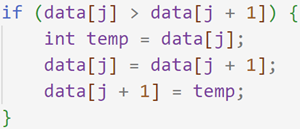
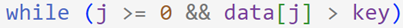
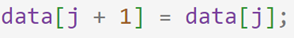
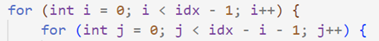
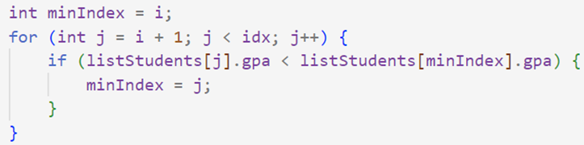
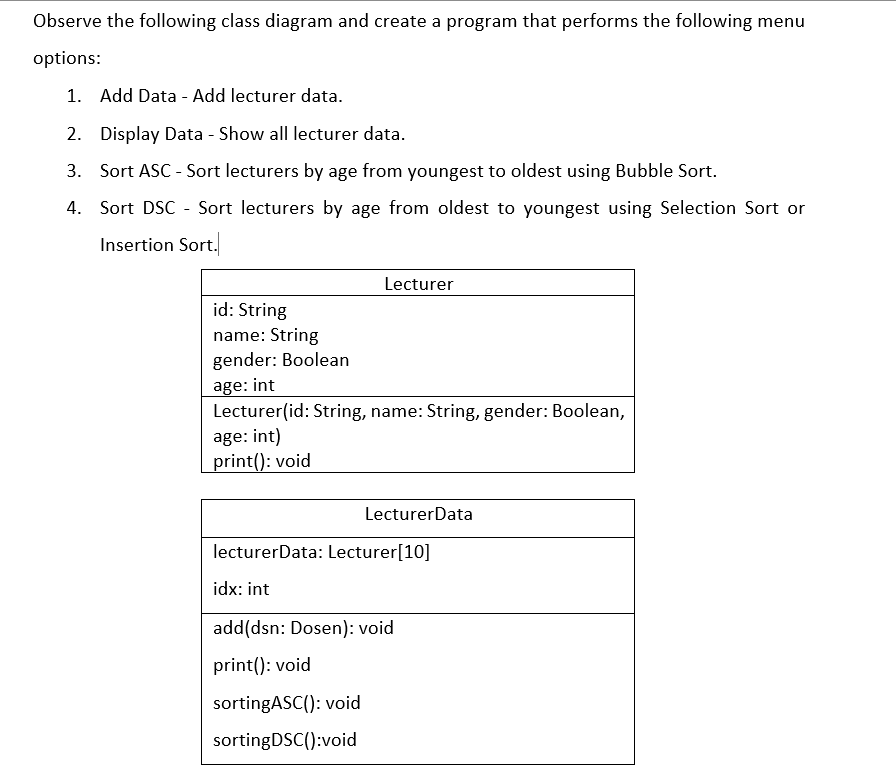

# Jobsheet 6 ASD
## 6.2 Experiment 1 - Implementing Sorting Using Objects; Questions
### 1. Explain the function of the following program code:
 <br/>
First, it checks if data[j] is bigger than data[j+1], if it does, it then stores the data of data[j] to a temporary variable, then the value of data[j] is rep;aced with the value of data[j+1], then the value of data[j+1] is replaced with the value in the temporary variable

### 2. Show the program code that implements the minimum value search algorithm in selection sort!
```java
for (int j = i + 1; j < size; j++) {
  if (data[j] < data[minIndex]) {
    minIndex = j;
  }
}
```

### 3. In insertion sort, explain the purpose of the condition in the loop. 
<br/>
It first checks if j is more or equal to 0, then it checks if the value in data[j] is bigger than the key

### 4.  In insertion sort, what is the purpose of the given command?
<br/>
it replaces the value in data[j+1] with data [j]

## 6.3	Experiment 2- Sorting Using an Array of Objects; Questions
### 6.3.1 Experiment Steps - Sorting Student Data Based on GPA (Bubble Sort)
#### 1. From the following code snippet, answer question a-c
 <br/>
- a. Why is the condition in the bubbleSort() loop i < idx - 1? <br/>
  Because it loops to every single element in the array
- b.	Why is the condition in the bubbleSort() loop j < idx - i - 1? <br/>
  Because it only needs to loop to every single element in the array except the last one because it's already sorted
- c.	If the number of data in listStudents is 50, how many times will the i loop execute? How many stages of Bubble Sort will be performed? <br/>
  The i loop will execute 50 times, and Bubble Sort will need to perform 49 stages


#### 2. Modify the above program to allow dynamic student data input (from the keyboard) consisting of nim, name, studentClass, and gpa.
```java
Scanner sc = new Scanner(System.in);
    System.out.print("Enter the number of students: ");
    int size = sc.nextInt();
    TopStudent5 topStudents = new TopStudent5(size);
    sc.nextLine();
    for (int i = 0; i < size; i++) {
      System.out.println("Student " + (i + 1));
      System.out.print("NIM: ");
      String nim = sc.nextLine();
      System.out.print("Name: ");
      String name = sc.nextLine();
      System.out.print("Class: ");
      String studentClass = sc.nextLine();
      System.out.print("GPA: ");
      double gpa = sc.nextDouble();
      sc.nextLine();
      topStudents.add(new Student5(nim, name, studentClass, gpa));
      System.out.println();
    }
```

### 6.3.5 Sorting Student Data Based on GPA (Selection Sort)
#### Explain the following code snippet in the correlation with the selection sort!
<br/>
it first stores the index which has the minimum value to minIndex, then it uses for loop to loop through every other elements, then checks if the value of listStudents[j].gpa is less than listStudents[minIndex].gpa, which if it is then modifies the minIndex value to j

### 6.3.10 Sorting Student Data Based on GPA Using Insertion Sort

#### Modify the insertionSort() method so that it can perform a descending sorting!

```java
public void insertionSort() {
    for (int i = 1; i < idx; i++) {
      Student5 temp = listStudents[i];
      int j = i;

      // Move elements that have bigger GPA to the right
      while (j > 0 && listStudents[j - 1].gpa < temp.gpa) {
        listStudents[j] = listStudents[j - 1];
        j--;
      }
      listStudents[j] = temp;
    }
  }
```

## 6.4 Assignment

[<a href="https://github.com/Bagassatwi/ASD/tree/Jobsheet6" target="_blank">https://github.com/Bagassatwi/ASD/tree/Jobsheet6</a>](https://github.com/Bagassatwi/ASD/tree/Jobsheet6/Jobsheet6)
