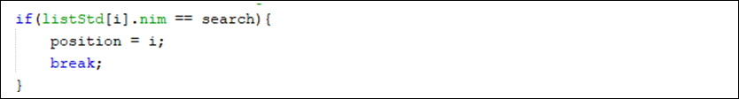

# Jobsheet 7 ASD

## 7.2 Sequential Search Method - Questions

### 1. What is the difference between the methods showData and showPosition in SearchStudent class? 

  - showPosition: Outputs the specific index of the array where the target data is located, or a notification if the data is not found
  - showData: Displays the full attribute details (NIM, Name, Age, and IPK) of the student object corresponding to the found index

### 2. What is the function of break in this following program code? 

 <br>
The break statement terminates the for loop once the searched element is found

### 3. If the NIM data inserted is not sorted from smallest to biggest value, will the program encounter an error? Is the result still correct? Why is that? 

No, the program will not encounter an error, and it will still be correct because sequential search works by searching each element in the array one by one from the start until the end

### 4. Look at findSeqSearch method, why position is initialized by -1 instead of 0? 

The variable is initialized to -1 to represent a that the element doesn't exist.

-----

## 7.3 Binary Search Method - Questions

### 1. Show the program code in which runs the divide process! 

```java
mid = (left + right) / 2; 
```

### 2. Show the program code in which runs the conquer process! 

```java
if (cari == listMHs[mid].nim) {
    return (mid);
} else if (listMHs[mid].nim > cari) {
    return FindBinarySearch(cari, left, mid - 1);
} else {
    return FindBinarySearch(cari, mid + 1, right);
} 
```

### 3. If inserted NIM data is not sorted, will the program give the correct result? Why? 

No, the program will likely fail to find the data because binary search relies on sorted data. 

### 4. If inserted NIM data is sorted from largest to smallest value (e.g 20215, 20214 20212, 20211, 20210) and element being searched is 20210. How is the result of binary search? does it return the correct one? if not, then change the code so that the binary search executed properly

The algorithm will fail to locate the element and returns -1 because the current implementation assumes ascending order.
corrected code for descending data:
```java
    if (right >= left) {
      mid = (left + right) / 2;
      if (cari == listStd[mid].nim) {
        return (mid);
      } else if (listStd[mid].nim < cari) {
        return findBinarySearch(cari, left, mid - 1);
      } else {
        return findBinarySearch(cari, mid + 1, right);
      }
    }
```

### 5. Modify program above so that the students amount inserted is matched with user input 

```java
Scanner sc = new Scanner(System.in);
System.out.print("Enter the number of students: ");
int amountStudent = sc.nextInt();
SearchStudent5 data = new SearchStudent5(amountStudent);
```