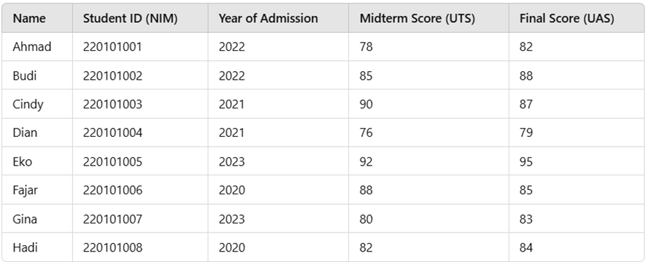

# Jobsheet 5 Brute-Force and Divide-Conquer

## 5.2.3 Calculating Factorial Using Brute Force and Divide and Conquer Algorithms
### 1. In the base case of the Divide and Conquer algorithm for calculating factorial, explain the differences in the code structure between the if and else conditions! 
- **`if`:** The base case where n == 1, and it returns the value 1 to stop the recursion. 
- **`else`:** The recursive step where the problem is divided into a smaller sub-problem (n-1) and multiplied by n to reach the final result. 

### 2. Is it possible to modify the loop in the factorialBF() method to use an alternative to the for loop? Please explain and give example if needed! 
- Yes, it's possible to use a `while` loop and/or a `do-while` loop as an alternative. 
```java
int factorialBF(int n) {
    int facto = 1;
    int i = 1;
    while (i <= n) {
        facto = facto * i;
        i++;
    }
    return facto;
}

```
### 3. Please explain the differences between facto = facto*i; and int facto = n * factorialDC(n-1);! 
- **`facto = facto * i;`**: Iterative approach used in Brute Force where the result is updated within a loop. 
- **`int facto = n * factorialDC(n-1);`**: This is a recursive approach used in Divide and Conquer where the function calls itself with a smaller value to calculate the factorial. 

### 4. Make a conclusion about the differences in how each method works: factorialBF() and factorialDC()! 
- **`factorialBF()`**: Works by calculating the result through an iteration from 1 to n. 
- **`factorialDC()`**: Works by breaking the problem down into smaller sub-problems until it reaches a base case then combining those results back up. 

## 5.3.3 Calculating Exponentiation Using Brute Force and Divide and Conquer Algorithms
### 1. Explain the differences between the two methods created: powerBF() dan powerDC()! 
- **`powerBF()`**: Uses a loop to multiply the base number by itself e times to calculate the exponentiation
- **`powerDC()`**: Splits the exponent calculation in half (e/2) recursively to calculate the exponentiation 

### 2. Does the combine stage exist in the provided powerDC() code? Show the relevant part! 
Yes, the combine stage exists
```java
// Even exponents:
return (powerDC(n, e/2) * powerDC(n, e/2)); 
// Odd exponents:
return (powerDC(n, e/2) * powerDC(n, e/2) * n);
```
### 3. In the powerBF() method, parameters are used to pass the base number and its exponent. Do you think it is still relevant? Could it be implemented without parameters? 
- It is less relevant if the method is inside the `Power` class, as it can access the class attributes directly.
- Yes, it can be implemented without parameters by using `this.baseNumber` and `this.exponent`. 
```java
int powerBF() {
    int result = 1;
    for (int i = 0; i < exponent; i++) {
        result = result * baseNumber;
    }
    return result;
}
```

### 4. Summarize how the powerBF() and powerDC() methods work! 
- **`powerBF()`**: Multiplies the base number n times using a loop. 
- **`powerDC()`**: Uses the property x<sup>n</sup> = x<sup><sup>n</sup>/<sub>2</sub></sup> * x<sup><sup>n</sup>/<sub>2</sub></sup> to solve the problem via recursion. 

## 5.4.3 Calculating Array Sum Using Brute Force and Divide and Conquer Algorithms
### 1. Why is mid variable needed in totalDC() method? 
- The `mid` variable is needed to divide the array into two smaller halves. 

### 2. Explain the following statements in totalDC() method: `double lsum = totalDC(arr, l, mid); and double rsum = totalDC(arr, mid+1, r);`! 
- **`double lsum = totalDC(arr, l, mid);`**: Calculates the sum of the left half of the array. 
- **`double rsum = totalDC(arr, mid+1, r);`**: Calculates the sum of the right half of the array. 

### 3. Why is it necessary to sum the results of lsum and rsum? 
- To get the total sum of the whole array.

### 4. What is the base case of totalDC() method? 
- The base case is 
  ```java
    if (l == r) {
      return arr[l];
    }
  ```

### 5. Draw a conclusion about how totalDC() works! 
- It works by splitting the array into two halves until single elements are reached, then recursively summing those elements back together to find the total. 

## 5.5 Assignments 
### A university has a list of student grades with data as shown in the table below.

- Find the highest Midterm Score (UTS) using the Divide and Conquer approach.
- Find the lowest Midterm Score (UTS) using the Divide and Conquer approach.
- Calculate the average Final Score (UAS) of all students using the Brute Force approach.

```java
// a) Find highest UTS using Divide and Conquer
public static int findMaxUTS(int l, int r) {
    if (l == r) {
      return list[l].uts;
    }
    int mid = (l + r) / 2;
    int leftMax = findMaxUTS(l, mid);
    int rightMax = findMaxUTS(mid + 1, r);

    return (leftMax > rightMax) ? leftMax : rightMax;
  }

// b) Find lowest UTS using Divide and Conquer
public static int findMinUTS(int l, int r) {
    if (l == r) {
      return list[l].uts;
    }
    int mid = (l + r) / 2;
    int leftMin = findMinUTS(l, mid);
    int rightMin = findMinUTS(mid + 1, r);

    return (leftMin < rightMin) ? leftMin : rightMin;
  }

// c) Calculate average UAS using Brute Force
public static double calculateAvgUAS() {
    double total = 0;
    for (int i = 0; i < list.length; i++) {
      total += list[i].uas;
    }
    return total / list.length;
  }

```